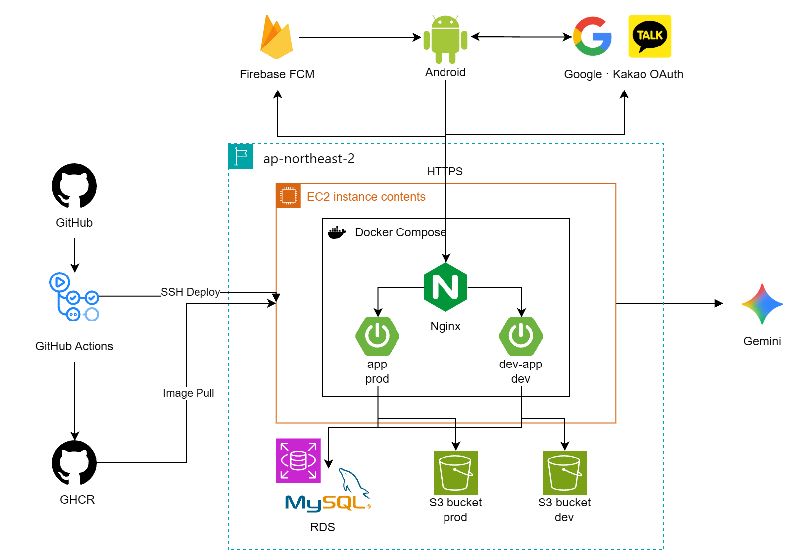

<div align="center">


<br/>

### 익숙해서 놓치고 있던 관계를 다시 바라보다

**HALO**는 자녀와 부모님이  
매일 하나의 질문과 작은 행동을 통해  
관계를 한 권의 이야기로 완성해가는 서비스입니다.

<br/>

</div>

---

# 📌 서비스 소개

> 매일 한 장, 부모님과 이어가는 따듯한 안녕

HALO Backend는 Spring Boot 기반의 REST API 서버입니다.
인증부터 온보딩, 스토리북·장(Chapter) 진행, 캘린더, 테마함, 알림까지 서비스 전반의 비즈니스 로직과 데이터를 관리합니다.

---

# 🗓️ 개발 기간

**2026.06 ~ 2026.08**

---

# 👥 팀원 소개

|      이름      | 담당 도메인                               |                            GitHub                            |
|:------------:|--------------------------------------|:------------------------------------------------------------:|
| **김서현 (PL)** | 장(Chapter), 이미지, 배포                  |         [@seohyeonS2](https://github.com/seohyeonS2)         |
|   **홍정민**    | 온보딩, 관계 정보, 약관, 테마함, 캘린더             | [@jmjmjmin24-commits](https://github.com/jmjmjmin24-commits) |
|   **한혜담**    | 홈, 스토리북, 기념일                         |             [@hhd517](https://github.com/hhd517)             |
|   **신재현**    | 회원, 설정, 알림, Gemini 연동(장 요약/알림 문구 생성) |       [@shin-jaehyun](https://github.com/shin-jaehyun)       |

---

# 🛠 Tech Stack

### 💻 Language


### 🌱 Framework


### 🔐 Security


### 🗄️ Database


### ☁️ Infra


### 🔗 외부 연동


### ⚙️ Build & Collaboration


---

# 🏗️ 인프라 아키텍처

<p align="center">
  
</p>

- **Compute**: AWS EC2 + Docker Compose로 운영(prod)·개발(dev) 서버 운영
- **Reverse Proxy**: Nginx + Let's Encrypt(Certbot)로 HTTPS 처리 및 도메인별 라우팅
- **Database**: AWS RDS(MySQL), Flyway로 스키마 버전 관리
- **Storage**: AWS S3, 이미지는 presigned URL로 서버를 거치지 않고 직접 업로드/조회
- **CI/CD**: GitHub Actions → GHCR 이미지 빌드/배포, 배포 후 헬스체크 기반 자동 롤백
- **외부 연동**: Google/Kakao 소셜 로그인, Firebase FCM(푸시 알림), Gemini API(장 기록 요약)

클라이언트는 소셜 로그인으로 인증 상태를 유지하며, HTTPS로 API 서버와 통신합니다.

---

# 🚀 주요 기능

| 도메인            | 설명                                 |
|----------------|------------------------------------|
| 인증 · 계정        | 구글/카카오 소셜 로그인, JWT 기반 인증, 회원 정보 관리 |
| 약관             | 약관 동의 처리 및 조회                      |
| 온보딩 · 관계       | 닉네임/태그 설정으로 온보딩 진행, 부모-자녀 관계 정보 관리 |
| 스토리북 · 챕터 · 기록 | 스토리북 시작, 하루 한 장씩 진행하며 기록 작성/다시보기   |
| 이미지            | 기록용 이미지 S3 직접 업로드(presigned URL)   |
| 캘린더 · 테마함      | 월/일별 기록 조회, 완성한 스토리북 모아보기          |
| BGM            | 배경음악 선택 및 설정                       |
| 알림             | 푸시 알림 설정, 기념일 등록                   |

---

# 🗃️ 데이터베이스 설계

전체 테이블(태그·스토리북·사용자 스토리북·설정·알림·사용자·약관)과 컬럼별 설계 이유는 ERD와 노션 문서를 참고해 주세요.

**전체 설계 원칙**

- 모든 테이블은 `BaseEntity`를 상속해 `created_at` / `updated_at`을 공통으로 가짐
- PK는 `{테이블명}_id` 형태의 `bigint auto_increment`로 통일
- N:M 관계는 관계 자체에 속성(우선순위, 동의 여부 등)이 붙기 때문에 전부 연결 테이블(`member_tag`, `storybook_tag`, `member_term`)로 구성
- 문자 인코딩은 이모지 저장을 위해 `utf8mb4_unicode_ci`로 통일
- 제3정규화(3NF)를 만족하도록 설계 — 예: 캐릭터 고유 정보와 화면별 이미지(`storybook_character` / `storybook_character_variant`) 분리, 콘텐츠 마스터 데이터(
  `bgm`, `common_anniversary`)와 회원별 데이터 분리

📎 ERD: [ERDCloud](https://www.erdcloud.com/d/hEtsvWza3L7g8HB3s)

---

# 📄 Documentation

| Document | Link                                                                               |
|----------|------------------------------------------------------------------------------------|
| 컨벤션      | [Notion](https://exuberant-light-1c4.notion.site/38dca1e217c0809abcaafb1a1d23ada7) |
| ERD      | [ERDCloud](https://www.erdcloud.com/d/hEtsvWza3L7g8HB3s)                           |

---

# 📂 프로젝트 구조

```text
src
├── main
│   ├── java
│   │   └── com.umc.halo
│   │       ├── domain
│   │       │   ├── calendar
│   │       │   ├── content
│   │       │   ├── exhibition
│   │       │   ├── image
│   │       │   ├── member
│   │       │   ├── notification
│   │       │   ├── onboarding
│   │       │   ├── record
│   │       │   ├── relationship
│   │       │   ├── setting
│   │       │   ├── tag
│   │       │   └── term
│   │       ├── global
│   │       └── HaloServerApplication.java
│   └── resources
│       └── db/migration   # Flyway 마이그레이션
└── test
```

| Package     | Description           |
|-------------|-----------------------|
| `domain`    | 도메인별 비즈니스 로직          |
| `global`    | 공통 설정 및 예외 처리         |
| `resources` | 설정 파일 및 Flyway 마이그레이션 |
| `test`      | 테스트 코드                |

각 도메인은 `controller` / `service` / `repository` / `dto` / `converter` / `entity` 레이어드 구조를 따릅니다.

---

# 📋 Requirements

- Java 21
- Spring Boot 4.1.0
- Gradle 8.x
- MySQL 8.x

---

# 📐 Convention

### 🌿 Branch Strategy

| Branch              | Description                                       |
|---------------------|---------------------------------------------------|
| `main`              | 배포 브랜치 (직접 작업 금지)                                 |
| `develop`           | 개발 통합 브랜치                                         |
| `feat/#이슈번호-설명`     | 기능 개발                                             |
| `fix/#이슈번호-설명`      | 버그 수정                                             |
| `refactor/#이슈번호-설명` | 리팩토링                                              |
| `chore/#이슈번호-설명`    | 설정 및 기타 작업                                        |
| `docs/#이슈번호-설명`     | README, 문서 및 주석 수정                                |
| `hotfix/#이슈번호-설명`   | 배포 후 긴급 수정 (`main`에서 분기 후 `main`·`develop` 모두 병합) |

### 💬 Commit Convention

| Type       | Description     |
|------------|-----------------|
| `feat`     | 새로운 기능 추가       |
| `fix`      | 버그 수정           |
| `refactor` | 리팩토링 (기능 변경 없음) |
| `docs`     | 문서/주석 수정        |
| `chore`    | 빌드 설정, 패키지 관리 등 |
| `init`     | 프로젝트 초기 세팅      |
| `test`     | 테스트 작성          |

커밋은 논리적으로 독립된 작업 단위로 쪼개어 작성합니다.

### 🔀 Pull Request

- Base Branch: `develop`
- 제목 형식: `[Type] 구현 내용 요약`
- 리뷰어 1명 이상 지정, AI 리뷰봇 피드백 확인 및 반영
- 팀원 1명 이상의 Approve 후 (본인이) `develop`에 병합

### 🗄️ 마이그레이션

- `hibernate.ddl-auto: validate` + Flyway로 스키마 관리 (자동 DDL 없음)
- 위치: `src/main/resources/db/migration/`, 네이밍: `V{버전}__{설명}.sql`
- 데이터 이관 + 제약 추가 + 테이블 삭제가 함께 필요한 경우 버전을 분리해 작성 (`migrate` → `add_constraint` → `drop`)

> 상세 컨벤션(엔티티, DTO, 예외 처리, 공통 응답 포맷 등)은 노션 백엔드 컨벤션 문서를 참고해 주세요.

---

<div align="center">

### HALO Team

부모님과 나 사이의 작은 안녕을
하루 한 장의 이야기로 기록합니다.

<br/>


</div>
